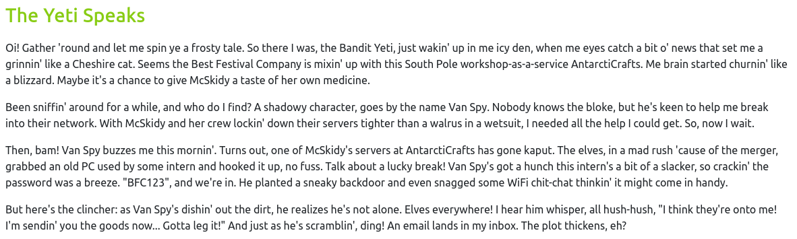
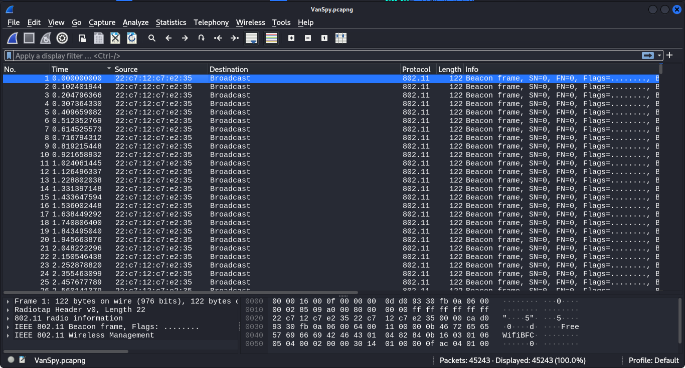
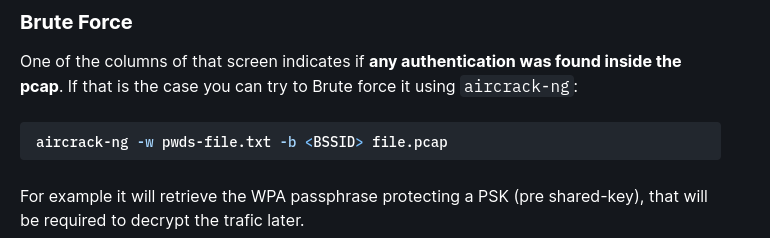
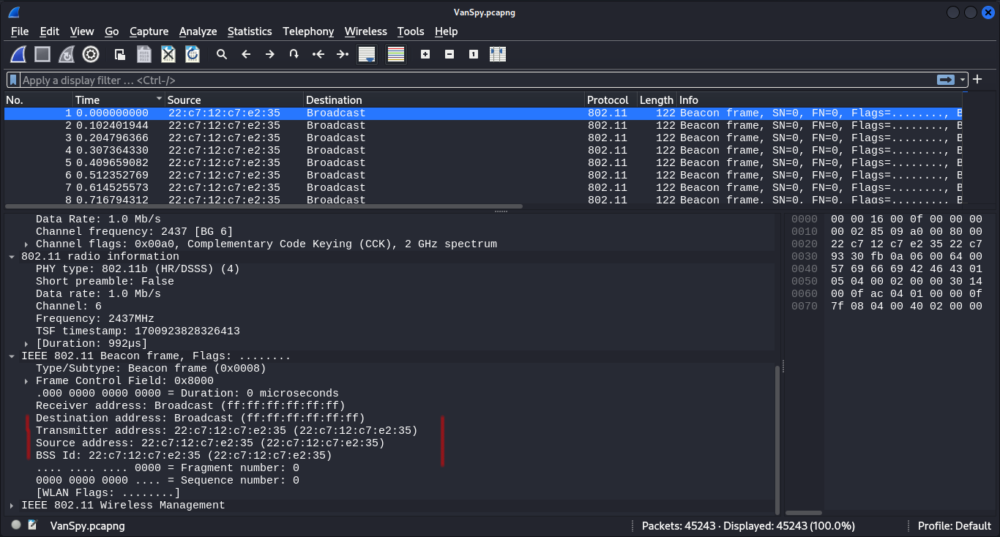
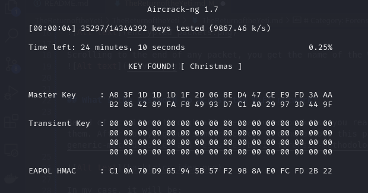

## Introduction
Every year, TryHackMe hosts Advent of Cyber event. During this event, several fields of cybersecurity are covered through solving tasks. The event is aimed at beginners though anyone with an interest in cybersecurity can learn and benefit immensely from it.

Also, another set of tasks called Advent of Cyber Side Quests which are meant for intermediate individuals and beyond. Today, we'll cover the first one since I was able to solve most of it.

# Category: Forensics

## What's the name of the WiFi network in the PCAP?

First step is to download the required file which is in a zip format. On unzipping, you are presented with VanSpy.pcapng.So this is a new generation packet capture file and it immediately tells you that WireShark is involved.

Firing up Wireshark, I'm presented with the following

Scrolling to the end of any packet, you get the name of the WiFi network which is the value of the SSID i.e., FreeWifiBFC

## What's the password to access the WiFi network?

Based of scrolling through all the captured packets, you realize that they are encrypted and needed to find a way to decrypt them. After carrying out some research, I came across this page from HackTricks (https://book.hacktricks.xyz/generic-methodologies-and-resources/basic-forensic-methodology/pcap-inspection/wifi-pcap-analysis)

In my case, it will be:

aircrack-ng -w /usr/share/wordlists/rockyou.txt -b 22:c7:12:c7:e2:35 VanSpy2.pcap

Here is a breakdown of the cases, I chose rockyou are the wordlist since it is commonly used. BBSID is shown below:

I tried running it the command using the original file i.e., aircrack-ng -w /usr/share/wordlists/rockyou.txt -b 22:c7:12:c7:e2:35 VanSpy.pcapng, but aircrack-ng doesn't support this file type.

By running the command, we get the passowrd to access the WiFi network

